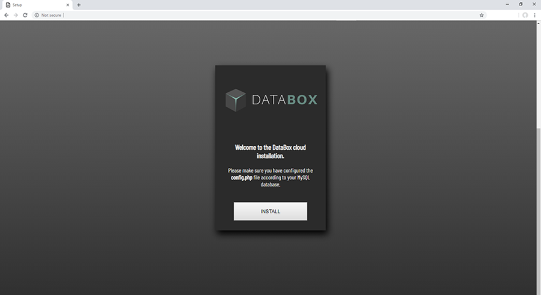
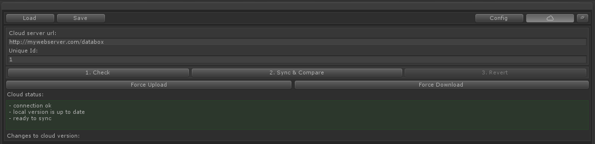

# Cloud
The cloud feature basically allows you to sync/download and upload the complete data of a Databox Object to a MySQL database.  
Please follow these instructions carefully to install the Databox cloud to your webserver.  

> You will need a MySQL database also your server must support PHP. Please refer to your webhosting company if you are not sure how to setup a MySQL database.  

## Configuration

1. Navigate to the `CloudSerivce` folder inside of the Databox unity project folder.  
2. Open the `config.php` file with your default text editing tool.  
3. You will see following text:
```csharp
$dbhost = 'localhost';
$dbuser = 'MySQL user';
$dbpass = 'MySQL password';
$dbname = 'MySQL database';
$dbtable = 'Databox';
```  
Please add the string information according to your MySQL database setup. The `dbtable` name will be used during the Databox cloud setup you can leave it like this or change it.  

4. Save the `config.php` file  
5. Connect to your webserver via FTP and create a new folder.  
6. Upload all files located in the `CloudService` folder to your newly created folder via FTP.  
7. Open your default web browser and navigate to the `setup.php` file which is located in the newly created folder. So if you have uploaded all files to a folder called "databox", navigate to: http://mywebserver.com/databox/setup.php  
8. You should now see the databox setup screen.
  
9. Click on install.  
10. Databox Cloud has been installed on your server.  
  
11. You can now use the server url in the unity databox object. (the folder where you have uploaded all files) Example: http://mywebserver.com/databox  

## Unique ID
> You can use the Unique id in the configuration to create different upload versions for different Databox Objects or for different team members.


# Sync to cloud
It is always wise to save your file before doing a sync.  

`1. Check`  
Before you can sync you'll need to click on the `1. Check` button. This will check if the connection to the cloud is ready and which version is newer - local version or cloud version.  
`2. Sync & Compare`    
After the check has been accomplished you can click on `2. Sync & Compare`. This will sync to the newest version. You will see all changes in the output.  
`3. Revert`  
If you don't like the changes you can then click on `3. Revert`. This will revert the data back to the version before sync.
`Force Upload`  
Forcing an upload overrides the cloud version with your local version. No matter which version is newer!
`Force Download`  
Forcing a download overrides the local version with the cloud version. No matter which version is newer!

!> Warning! Only use force upload and download if you know what you do.
