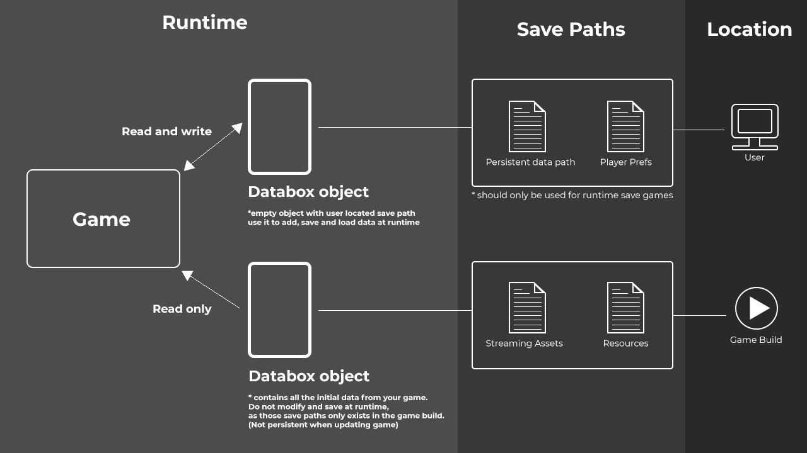

# Concept And Workflow
A Databox object (Scriptable object file) serves as a container for your data. All your data is nicely structured in tables, entries and values.

A Databox object saves and loads the data to a file. Depending on the serializer and data format you have chosen this can be a json file or a binary file.

You can setup multiple Databox objects in your project each with different save paths and file names if you like. Please consider following image in regards of all available save paths. It is important to know the location of a save paths. (User device/User computer or Game build)
  

  

## Workflow

If you like to use Databox not only as a data container but also as a save system it is best to create two Databox objects. One containing your initial game data which lives in the game build and another empty Databox object which has a persistent save path configured - this one is used for storing runtime data on the users machine.

During runtime you can now easily "register" an existing entry from your initial Databox object to the runtime empty Databox object by using following code:
```csharp
    public DataboxObject initialData;
    public DataboxObject runtimeData;
    initialData.RegisterToDatabase(runtimeData, "Initial table name", "Initial entry name", "New and unique entry name"));
```

By using `RegisterToDatabase`, Databox populates the runtime Databox object with an initial entry from the initial Databox object. It is important to pass a unique string id for the new entry name. For example, when instantiating multiple "enemies" of the same type "Boss1" you should make sure to register them with an unique id, to make sure each enemy has its unique assigned values in the runtime Databox object.  

**For using a unique id you could use:**  
```csharp
    this.gameObject.GetInstanceID().ToString()
```
  
Instead of using `RegisterToDatabase` you can also simply copy the initial file to the persistent data path. When your game starts for the first time. For more information about this workflow please see: [Save and Load on Mobile](/SaveAndLoadMobile.md)

