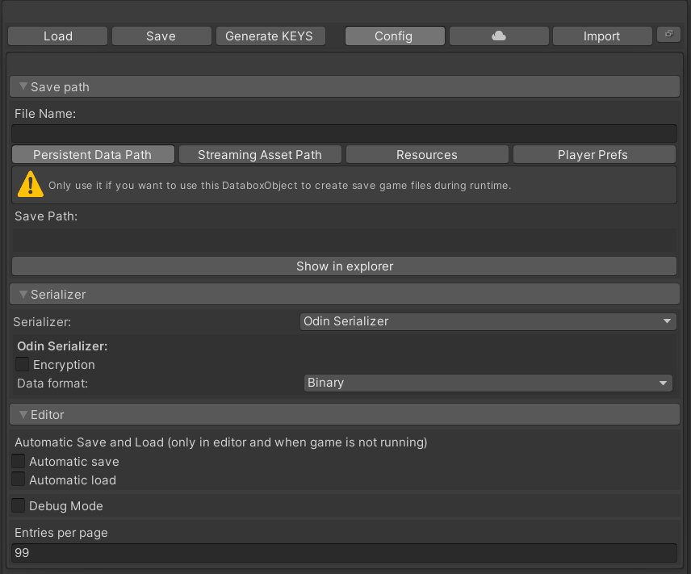

# Databox Object  

The Databox object serves as a container for your loaded data. Your data is saved to a file.  
Depending on your project you can have multiple Databox objects or just one which loads different files at runtime.  
When referencing a Databox object you have access to several methods for accessing the data, loading and saving at runtime.  

## Configuration

  

### Save path
> Before you can start adding data to your Databox object. You will need to specify a file name and a save path in the config. menu.  

``File name``  
The file name relative to the chosen save folder. You can also specify a subfolder.  

> Please note: due to the nature of how text/binary files are being loaded from the Resources folder by Unity, you will need to specify either .txt or .json as the file extension.
  
`Persistent Data Path:`  
Should be used for save game data only. Do not use it for your initial database data as it will not be included in a build.  
`Streaming Asset Path:`  
Uses the "StreamingAssets" folder inside of your project. Great for files that should be loaded and saved upon runtime.
`Resources:`  
Use the resources path for loading the database file from a resources folder. It's not possible to save to a resources folder during runtime.
`PlayerPrefs:`  
Player prefs are a good way to create save games at runtime. Do not use it for your initial database data as it will not be included in a build.

> Make sure to check out the official Unity documentation regarding the different save paths:  

[Persistent data path](https://docs.unity3d.com/ScriptReference/Application-persistentDataPath.html)  
[Streaming Assets](https://docs.unity3d.com/ScriptReference/Application-streamingAssetsPath.html)  
  
### Serializer
Databox supports two different serializers. If you want to know more about those, please have a look at this page here:  
[Serializers](https://odininspector.com/odin-serializer)

#### Full Serializer  
`Encryption`  
Databox supports a simple XOR encryption. When enabled you'll need to provide an encryption key.  

`Compress Json`
Compressing the json file significantly reduces the file size. On the other hand, the json file is no longer easy to read in a text editing tool.

#### Odin Serializer
`Encryption`  
Databox supports a simple XOR encryption. When enabled you'll need to provide an encryption key.  

`Data Format`  
Odin serializer supports two different data formats.
  *JSON: Saves the data in a json formated file
  *Binary: Saves the data in a binary formated file. Usually smaller file size compared to json.
  
### Editor

`Automatic save`  
When enabled, Databox saves all changes made automatically. (Only in editor)  

`Automatic load`  
When enabled, Databox loads the data automatically when the Databox object is being selected in the editor.  

!> You will still need to load the data at runtime. 
  
`Debug Mode`  
By enabling debug mode, Databox will create console logs on several events.  

`Entries per page`  
Configure how many entries should be displayed per page in the Databox editor.  

## Generate Keys
Instead of using strings for calling GetData and AddData - which can be error prone - you can generate static keys from your DataboxObject. Another great advantage is, that static keys are structured in classes and sub-classes based on tables and entries.
  
1. Simply click on the Generate Keys button in the Databox Object editor.  
2. Select a file name and click on save.  

**Example:**  
The keys are now accessible by using the `databox object name + "_KEYS"`. Let's assume we have a DataboxObject called PlayerData then we can use:  
```csharp
    // Data is the table name - so we use TableName to access the static key
    PlayerData_KEYS.Data.TableName
    // Player is the entry name inside of the table Data - so we use EntryName to access the static key 
    PlayerData_KEYS.Data.Player.EntryName   
    // Health is located inside of the player entry - so we can simply use the _Health key.
    PlayerData_KEYS.Data.Player._Health
```  
**GetData Example:**  
```csharp
    public DataboxObject data;
    var health = data.GetData<IntType>(PlayerData_KEYS.Data.TableName, PlayerData_KEYS.Data.Player.EntryName, PlayerData_KEYS.Data.Player._Health);
```
