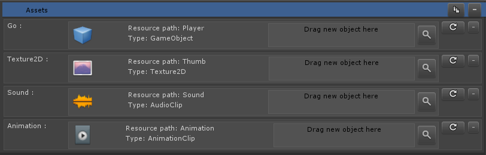
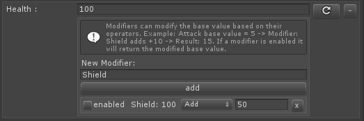

# Databox variable types
Databox comes with its own databox variable types.
A databox type derives from the DataboxType class, it not only contains the actual variable but also handles the UI drawing of the variable.
The class can be as simple as containing one variable or as complex as managing multiple variables. It can also contain custom logic.  
For an example please see the **ExampleDataTypeClass**

# Special types
## Resource type
  
  
The resource type is a special data type and stores the string path of an asset located in a resource folder.  
When calling the `GetData` on a Databox object with a ResourceType, Databox loads the prefab or asset automatically.

### Examples
```csharp
  // Loads a resource of type GameObject
  var _go = db.GetData<ResourceType>("Assets", "Player", "GameObject").Load() as GameObject;
  Instantiate(_go, Vector3.zero, Quaternion.identity);
```
  
```csharp
  // Loads a resource of type Texture2D
  var _thumb = db.GetData<ResourceType>("Assets", "Player", "Thumb").Load() as Texture2D;
```


## Addressables
Databox also supports the newly introduced Addressables by Unity.  
> Addressables are still in Beta, therefore it's possible that some features might change or break.

### Install

1. To use the addressables you need to first download the addressables package with the package manager inside of Unity.  
2. Make sure to open the addressables window for the first time. Go to: `Window -> Asset Management -> Addressables.` This is important so that the addressable system can do some pre-configurations.  
3. Now open the AddressableType.cs script inside of the Databox folder: `Databox -> Types -> AddressableType.cs.`  
4. Uncomment the script and wait for compilation.  
5. When adding a new value you can now select the addressable type.  

The addressable type in Databox simply saves the addressable path. You can select all available assets by a dropdown.  
To know how to use addressables (Instantiate, Loading) please refer to the official documentation here:  
[Documentation](https://docs.unity3d.com/Packages/com.unity.addressables@0.4/manual/index.html)  
  
## Modifiable Int and Float type
  
  
When using the modifiable int and float type you can add additional modifiers to the base value. 
When returning a value, it will be modified by the modifiers which are enabled.
  
Enable Modifier through code:  
```csharp
    var _health = data.GetData<IntWithModifiersType>("Table", "Entry" "Health");
    _health.Modifiers("Shield", true); // enable shield modifier
```

[IMAGE]
Here we have a health value which is set to 100. Additionally we have added one modifier called "Shield" which adds 50.  
So when returning the health value and modifier is enabled, Databox will return 150 instead of 100.
