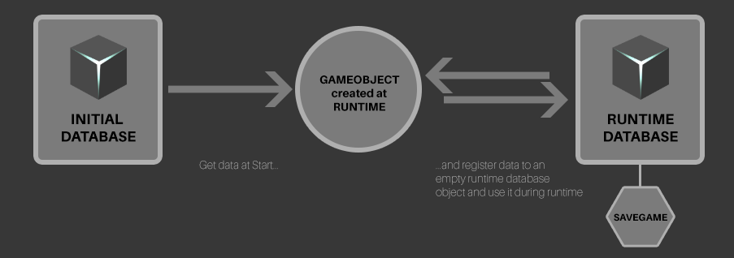

# Demo Scenes

## 01 Basic
  
The basic scene shows you the basic principals of Databox and how you can load and save existing objects during runtime.  

**Scripts**  
`SimpleDataboxLinkking.cs`
The cube and the sphere objects have both a script called "SimpleDataboxLinking".  
This script waits for the database to be loaded. On loaded it takes all values from the database and assigns them to the sphere. (position, color, speed, direction)  
  
`DataboxExample.cs`  
The DataboxExample script has some methods which are being called by the UI.(Save, Load, Reset) It also loads the database on start.  
  
  
## 02 On Value Changed
This examples shows the use of registering an on value change callback and react to it. Simply start the scene and click on the sphere.  
  
## 03 UI Binding
The UI binding example shows you how to bind Unity UI components to values of a Databox object. Each UI component in the scene has a DataboxUIBinding component assigned to it.  

## 04 Advanced example
  
  
This example shows the use of multiple database objects to support saving runtime generated objects.  
It also has a simple techtree which demonstrates how you can use a custom data class to store techtree relevant data.  

> The techtree UI dynamically rebuilds itself based on this data.  
  
**The general idea is as follow:**  
  
- We use the initial databox object for all assets we want to instantiate.  
- We use an empty runtime databox object which will maintain all instantiated objects at runtime.  
- At runtime a freshly instantiated object gets its data from the initial database and registers them into the runtime database with it's unique instance id.  
- We only change the data in the runtime database.  
- When loading, we iterate through all entries in the runtime database. As we have saved the type, position and color of each object we can easily re-create the saved state.  
  

**Techtree**  
  
  
The techtree UI dynamically rebuilds itself based on the tech data. This is a great demonstration of a custom data class.  
By changing the dependency in the tech data you can change the arrangement of the techtree UI.  
  
**Scripts**
`AdvancedDataboxLinking.cs`  
Registers the game object to the database according to objectID, fromDBId and toDBId variables.  
`AssignObjectValues.cs`  
Assigns all values to the object or the database.  
`PlaceAsset.cs`  
Makes sure the object moves along the mouse cursor and snaps to a grid. Also handles mouse click event and object instantiation. After user has clicked it calls the LinkToNewDatabase method in the AdvancedDataboxLinking script.  
`SaveManager.cs`  
The save manager handles the restoring of saved objects. After the database has been loaded a coroutine is being called which instantiates all saved objects back and registers them to the existing database as a new entry while removing the old entries.  
`UIManager.cs`  
The UI manager handles all ui inputs and dynamic UI creation. It also loads the initial database on Awake and builds the build menu ui after the initial database has been loaded.  
The techtree logic which handles the techtree UI creation and research is also integrated into this script.  
  
  
## 05 Cloud
Simple cloud upload and download example.  
Please make sure that the Databox cloud server has been configured correctly.  
  
!> Using the cloud feature at runtime by script does not check which version is newer. It simply overrides the local or cloud file, depending if you use download or upload. So please use this feature with caution!  
