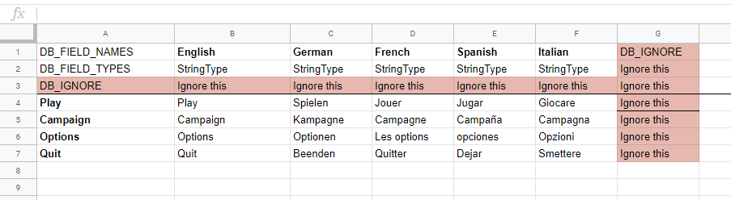
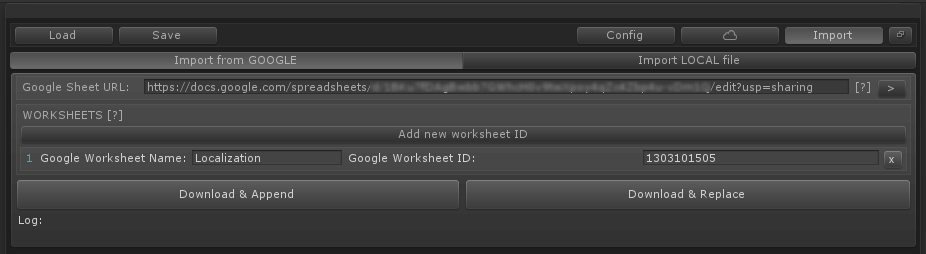
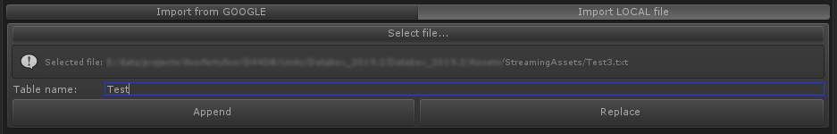

# Using Spreadsheets
To make sure Databox recognizes the correct data types you will need to setup the spreadsheet correctly.  
  
  
  
Use following keys to mark the appropriate fields:  
`DB_FIELD_NAMES`  
The actual name of the value/variable
`DB_FIELD_TYPES`  
The type of the value. Use the exact name of the data class. (FloatType, IntType...)
`DB_IGNORE`  
Mark rows and cells you don't want to import with this key.  
  
All basic types are supported. You can add additional support by adding your own convert method to your custom DataboxType class.

## Formats
Make sure to separate values by comma. For example:  

`Vector3` 0.3, 2.0, 4.0  
`Color` 255, 220, 120, 255  
`String list` A, B, C, D, E, F  

# Google Spreadsheets
  
  
You can import a Google spreadsheet with all worksheets without using any complicated Google authentication. You only need to enable the public share link.  
  
1. Open a spreadsheet file in Google.  
2. In the top right corner, click Share.  
3. Click `Get shareable link` in the top right of the `Share with others` box.  
4. To choose whether a person can view, comment, or edit the file, click the Down arrow next to `Anyone with the link.`  
5. Copy the link and paste it in the Google Sheet URL of the Import menu.

## Adding Worksheets.
To make sure Databox downloads all worksheets you will need to add them separately by it's unique link ID.

1. Open a spreadsheet file in Google.  
  
2. Search for the gid number in the browser URL field. Select and copy it.  
3. Go to the import menu of your Databox object, select import from Google and click on Add new worksheet ID.  
4. Add the table name you want to use and the gid number you have copied previously.  
5. Click `Download & Append` or `Download & Replace`.  

# Local CSV file
  
  
To import a CSV file simply select import from local file in the import menu.  

1. Select a text/csv file  
2. Define the table name  
3. Click on Append to add it to your existing database or Replace to replace the current database.  
  
