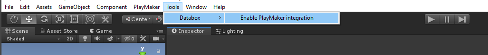
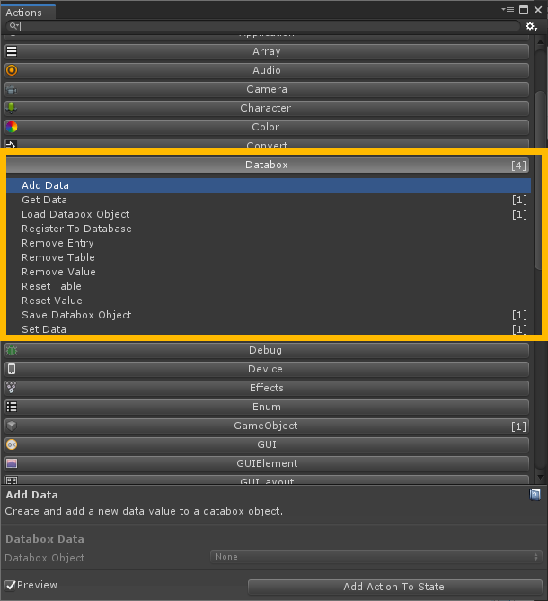
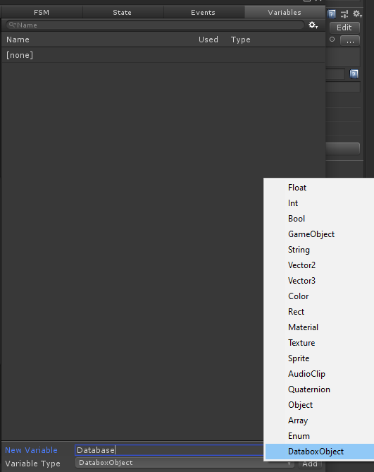

# Playmaker Setup
Since update 1.0.5 Databox officially supports PlayMaker.  
  
1. To enable the Databox PlayMaker integration select `Tools -> Databox -> Enable PlayMaker integration`.  
  
2. After compilation is done, all Databox-PlayMaker actions are available in the PlayMaker action browser.  
  
  
## Custom Databox Object variable
It is possible to create a DataboxObject variable in PlayMaker which can then be used for the Databox PlayMaker actions.  
  
  
