# LoadDataboxObject
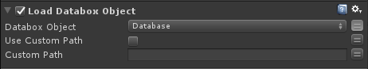  
Loads the selected Databox object file. Calls OnFinish when databox object has been loaded.  
  
# SaveDataboxObject
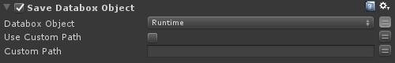  
Saves the selected Databox object to file.  
  
# GetData
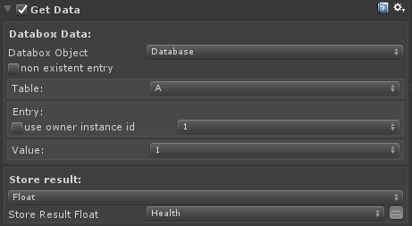  
Get data from Databox object and store it to a PlayMaker variable.  
  
`non existent entry`:  
set to true if entry does not exist in editor.(for example only on runtime) You can then type the IDs manually.  
`Use owner Instance ID`:  
if true, Databox uses the Owner Instance ID. This is useful if you have registered an entry at runtime by it's Instance ID.  
  
# SetData
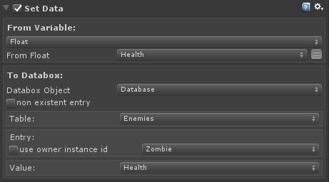  
Set data from a PlayMaker variable to a selected Databox value.

`non existent entry`:  
set to true if entry does not exist in editor.(for example only on runtime) You can then type the IDs manually.  
`Use owner Instance ID`:  
if true, Databox uses the Owner Instance ID. This is useful if you have registered an entry at runtime by it's Instance ID.  
  
# AddData
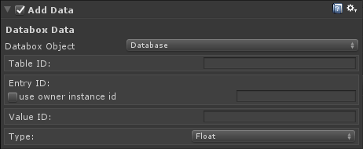  
Add a new Data entry to selected Databox object

  
# RemoveTable
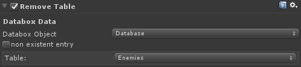  
  
# RemoveEntry
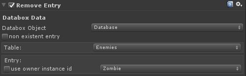  
  
# RemoveValue
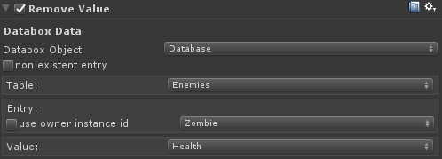  
  
# ResetTable
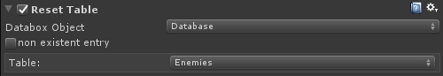  
  
# ResetValue
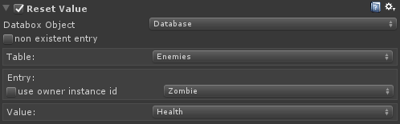  
  
# RegisterToDatabase
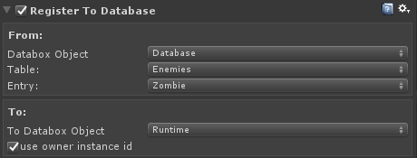  
  
