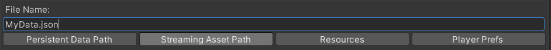

# QuickStart

This is a step by step tutorial for creating your first Databox object and adding data to it.

## Create a Databox object
A Databox object serves as a container for your data. Each Databox object can be configured with a different save path. 
This means that you could have multiple Databox objects in your project each handling different files in different locations.

For example you could use two Databox objects in your project to handle initial game data and save files.
The save files Databox object would be then just an empty Databox object pre-configured with the correct save path.  
> You can change a save path during runtime.

1. Right click in the project view and select: `Create / Databox / New Databox Object`  
2. Select the newly created Databox object and click on `Config`  
3. In the config menu you can now set your save path (file name + path). 
For example: `MyData.json`  
  
  
4. Select the `StreamingAssets` folder and make sure that you have a folder in your project named `StreamingAssets`  
Read more about all save paths here: [Concept & Workflow](/ConceptAndWorkflow.md)  

## Add Data
You are now ready to add your data.
Databox has its own Databox variable classes which can be used to create complex data classes including nested classes, lists and complex GUI based on the Unity IMGUI.

  
1. First we need to add a table. Enter a name for your table, for example: `Table1` and click on `Add Table`  
2. Select the newly created table tab.  

You can now add an entry. Each entry can contain multiple values.  
  
2. Enter `Enemy` as entry name and `Health` as value name.  
3. Because health should be an integer lets select the `Int` type.  
4. Click on `Add Value`  

Great! You have successfully added your first data.

## Modify Tables
You can modify tables anytime by clicking on the three `...` dots next to the table tabs.  
  
  
  
## Complex Data
Databox variable types are not limited to contain only one type for each value entry.
As an example lets add the `ExampleClass`
1. Enter a new name in the value field
2. Select the `ExampleClass` type 
3. Click `Add Value`

  
    
As you can see, this example class has much more then just one value. You can also create complex UI based on the Unity IMGUI.
Simply open the file `ExampleClass` file in your script editor to see how this was achieved.
More information about creating your own Databox Data type head over to:

## Save
Now that you have added your data you need to save it to your file.
Simply click on `Save` in the Databox Object editor.
You can also enable automatic saving in the config menu. Please note this only works in the Unity editor during design time.

## Load 
To load a file, simply select `Load` in the Databox object.
